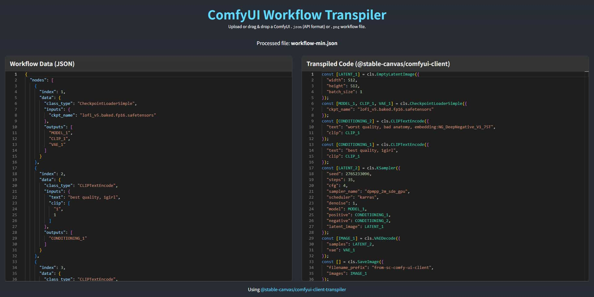

# tool-w2c

workflow to `comfyui-client` js code

[Online WebAPP: https://StableCanvas.github.io/tool-w2c](https://StableCanvas.github.io/tool-w2c)

## ref

based on [@stable-canvas/comfyui-client](https://github.com/StableCanvas/comfyui-client)
